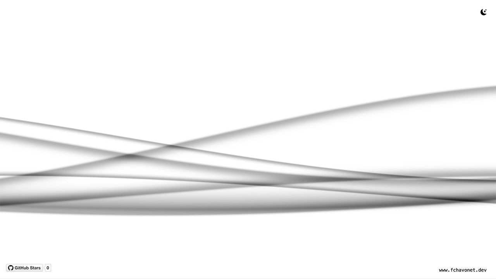

# XMB Wave Background

## Description

This project recreates the iconic XMB wave animation from the PlayStation Portable (PSP) menu interface, entirely using HTML, CSS, JavaScript, and WebGL.

It started as a personal challenge: I had never used WebGL before, but I was determined to bring this nostalgic visual effect to life in the browser. After exploring several shaders and digging into examples and experiments shared online, I gradually crafted a clean and responsive implementation that blends seamlessly into both light and dark themes.

The wave reacts dynamically depending on the color scheme of the user’s system, creating a soft, immersive background. This project is not only a tribute to the PSP, but also a hands-on study of how fragment shaders and WebGL contexts can be embedded in a modern web page.

## Objectives

- Discover and understand the basics of WebGL.
- Learn how to write and integrate a GLSL shader in a real project.
- Build a standalone animated wave background using fragment shaders.
- Dynamically adapt visuals to system color schemes (light/dark).
- Make it easy to reuse or integrate into other personal projects.

## Tech Stack


## File Description

|   **FILE**   | **DESCRIPTION**                                     |
| :----------: | --------------------------------------------------- |
|   `assets`   | Contains the resources required for the repository. |
| `index.html` | Main HTML structure for the project.                |
| `style.css`  | Styles and animations for the project.              |
| `script.js`  | Behavior script for interactivity.                  |
| `README.md`  | The README file you are currently reading 😉.       |

## Installation & Usage

### Installation

1. Clone this repository:
   - Open your preferred Terminal.
   - Navigate to the directory where you want to clone the repository.
   - Run the following command:

```
git clone https://github.com/fchavonet/creative_coding-xmb_wave_background.git
```

2. Open the cloned repository.

### Usage

1. Open the `index.html` file in your web browser.

You can also test the project online by clicking [here](https://fchavonet.github.io/creative_coding-xmb_wave_background/).

<p align="center">
    <picture>
        <source media="(prefers-color-scheme: dark)" srcset="./assets/images/screenshots/desktop_page_screenshot-dark.webp">
        <source media="(prefers-color-scheme: light)" srcset="./assets/images/screenshots/desktop_page_screenshot-light.webp">
        
    </picture>
</p>

## Customization

The wave reads its settings from `window.XMBWaveConfig`. Set defaults before loading the script, tweak them live from the in-page settings panel (the sliders icon in the top-right), or call the public API at runtime. User changes made through the panel are persisted to `localStorage` and override author defaults on the next visit.

### Defaults

| Setting        |  Default  | Range / values                     | Description                               |
| :------------- | :-------: | :--------------------------------- | :---------------------------------------- |
| `color`        | `#4d4d4d` | any CSS hex color                  | Base color shared by all wave layers      |
| `bgColorLight` | `#f5f5f5` | any CSS hex color                  | Background color used while in light mode |
| `bgColorDark`  | `#020408` | any CSS hex color                  | Background color used while in dark mode  |
| `speed`        |   `1.0`   | `0.1` – `3.0`                      | Global animation speed multiplier         |
| `waveHeight`   |   `1.0`   | `0.1` – `2.0`                      | Global amplitude multiplier               |
| `quality`      | `"auto"`  | `auto` / `low` / `medium` / `high` | Performance tier (see below)              |

The background picker in the settings panel always targets the _currently active_ mode — toggle light/dark to recolor the other.

### Author-set defaults (before script loads)

```html
<script>
  window.XMBWaveConfig = { color: "#00aaff", speed: 1.5, waveHeight: 0.8 };
</script>
<script src="./script.js" defer></script>
```

### Runtime API

```js
XMBWave.updateConfig({ color: "#ff5500", speed: 2.0 });
XMBWave.getConfig(); // current merged config
XMBWave.getEffectiveTier(); // resolved tier in use: "low" | "medium" | "high"
XMBWave.getDefaults();
```

## Performance

The shader is rendered in one of three quality tiers; `quality: "auto"` picks one based on user-agent, `navigator.hardwareConcurrency`, and `navigator.deviceMemory`.

| Tier   | Wave layers | DPR cap | Target FPS | Shader precision |
| :----- | :---------: | :-----: | :--------: | :--------------: |
| low    |      4      |   1.0   |     30     |     mediump      |
| medium |      6      |   1.0   |     60     |     mediump      |
| high   |      7      |   2.0   |     60     |      highp       |

Additional optimisations are always on:

- **DPR-aware sizing** so the GPU isn't rendering 4× pixels on Retina displays for the low/medium tiers.
- **FPS cap** in the render loop — frames are skipped to hit the tier's target.
- **Auto-downgrade watchdog**: with `quality: "auto"`, a sustained drop below 70% of target FPS for 3s steps the tier down one notch (one-way, no oscillation).
- **Visibility pause** — `requestAnimationFrame` work stops while the tab is hidden, with `uTime` offset so the animation doesn't jump on return.
- **Debounced resize** via a coalesced `requestAnimationFrame`.

Append `?debug=1` to the URL to show a live FPS / tier indicator.

## What's Next?

- [x] Implement performance tuning (for lower-end devices).
- [x] Create a customizable version (color, speed, wave height).

## Thanks

- Huge thanks to developers and artists who share GLSL demos and shader snippets online, especially those from [Shadertoy](https://www.shadertoy.com/). Your work was a great source of learning and inspiration.
- Shout-out to the PSP modding and retro-tech communities, this project is a little homage.

## Author(s)

**Fabien CHAVONET**

- GitHub: [@fchavonet](https://github.com/fchavonet)
